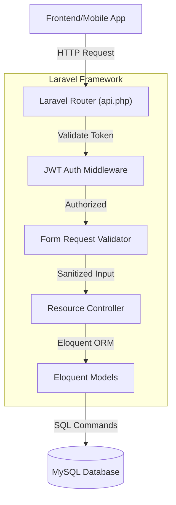
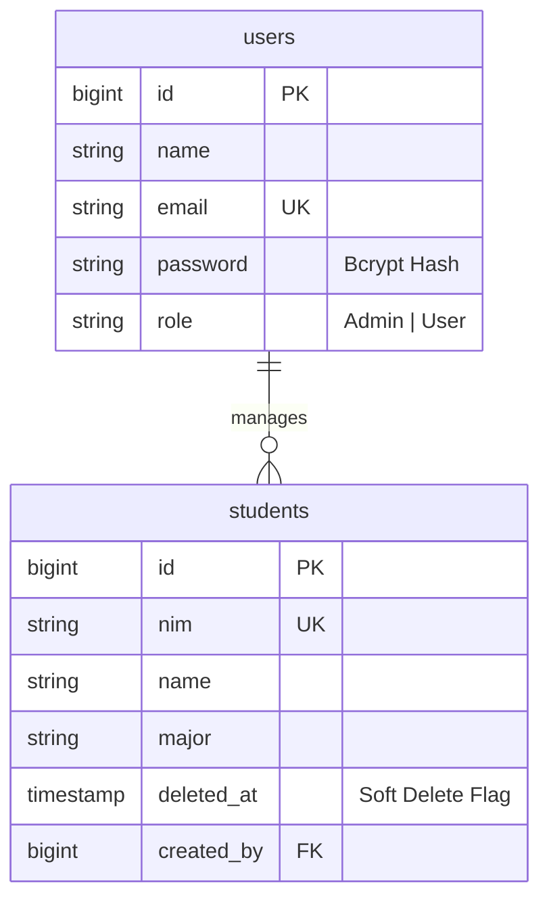

<div align="center">
  
  <br /><br />
  <a href="https://berlinsugi.vercel.app/docs-student-api.html">
    
  </a>
</div>

<p align="center">
  <a href="#"></a>
  <a href="#"></a>
  <a href="#"></a>
  <a href="#"></a>
</p>

---

## 📑 Table of Contents

- [About This Project](#-about-this-project)
- [Key Features](#-key-features)
- [Tech Stack](#-tech-stack)
- [Software Architecture](#-software-architecture)
- [Database Design](#-database-design)
- [Project Structure](#-project-structure)
- [Installation Guide](#-installation-guide)
- [Environment Variables](#-environment-variables)
- [API Documentation](#-api-documentation)
- [Authentication & Authorization](#-authentication--authorization)
- [Security](#-security)
- [Validation & Error Handling](#-validation--error-handling)
- [Performance Optimization & Scalability](#-performance-optimization--scalability)
- [Development Workflow & Deployment](#-development-workflow--deployment)
- [Roadmap & Known Limitations](#-roadmap--known-limitations)
- [Lessons Learned](#-lessons-learned)
- [Contributing](#-contributing)
- [Why This Project Demonstrates Software Engineering Skills](#-why-this-project-demonstrates-software-engineering-skills)

---

## 🎯 About This Project

### Why This Project Exists
Building a secure, highly scalable API is a critical backend engineering skill. **Student Management API** was engineered to demonstrate a deep understanding of standard REST principles, stateless authentication, and relational data protection via the powerful Laravel ecosystem. 

### The Problem Being Solved
Many academic applications suffer from insecure direct object references, permanent data loss upon accidental deletion, and bloated, stateful sessions. This API solves these issues by enforcing strict stateless JWT authentication, Role-Based Access Control (RBAC), and Eloquent Soft Deletes.

### Business Value
- **Data Preservation:** Critical academic records are never destroyed via SQL `DELETE`. They are merely hidden, maintaining historical integrity.
- **Client-Agnostic:** Because it is a strict JSON API, it can be seamlessly integrated with any frontend (React, Vue, iOS, Android).
- **Enterprise Security:** JWT payload validation prevents session hijacking and reduces database hits for authentication.

---

## ✨ Key Features

### Core Operations
*   **RESTful CRUD:** Fully compliant standard HTTP methods (GET, POST, PUT, DELETE) mapping to appropriate resource controllers.
*   **Pagination & Filtering:** Native integration of Laravel's paginator for handling massive student data sets without memory exhaustion.
*   **Soft Deletion Mechanism:** Eloquent SoftDeletes preserves historical data integrity.

### Security & Management
*   **Stateless JWT Authentication:** Implemented via `php-open-source-saver/jwt-auth` for secure, sessionless API access.
*   **Role-Based Access Control (RBAC):** Middleware protecting administrative endpoints from unauthorized student tokens.
*   **Form Request Validation:** Strict input sanitation at the framework boundary, before data ever reaches the controller layer.

---

## 💻 Tech Stack

### Backend & Database
*   **Framework:** Laravel 9
*   **Language:** PHP 8.x
*   **Database:** MySQL 8.0
*   **Authentication:** `tymon/jwt-auth` (via `php-open-source-saver/jwt-auth`)
*   **Dependency Manager:** Composer

### Tools & DevOps
*   **API Testing:** Postman
*   **Version Control:** Git & GitHub Actions
*   **Local Server:** Artisan `serve`

---

## 🏗️ Software Architecture

This project utilizes the **MVC (Model-View-Controller)** pattern, specifically tailored for API construction (ignoring the View layer in favor of JSON serialization).



### Why this architecture?
1.  **Strict Separation of Concerns:** Controllers never touch raw inputs directly. Form Requests handle validation, keeping Controllers lean.
2.  **Stateless Scalability:** By using JWT, the application server does not store session files, allowing it to be easily scaled across multiple load-balanced instances.

---

## 🗄️ Database Design



### Normalization Highlights
- **NIM Uniqueness:** The `nim` (Nomor Induk Mahasiswa) is enforced as unique at the database level to prevent duplicate enrollment records.
- **Soft Deletes:** The `deleted_at` timestamp ensures that accidental `DELETE` HTTP requests only logically hide the record.

---

## 📁 Project Structure

```text
├── app/
│   ├── Http/
│   │   ├── Controllers/   # API Resource Controllers
│   │   ├── Middleware/    # JWT and Role verification logic
│   │   └── Requests/      # Strict Form validation rules
│   └── Models/            # Eloquent Models (Student, User)
├── database/
│   ├── migrations/        # Database schema version control
│   └── seeders/           # Dummy data generation for testing
├── routes/
│   └── api.php            # API endpoint definitions
└── tests/                 # PHPUnit test cases
```

---

## 🚀 Installation Guide

### 1. Requirements
*   PHP 8.0+
*   Composer
*   MySQL

### 2. Clone & Install
```bash
git clone https://github.com/B3rlinSugi/student-management-api.git
cd student-management-api
composer install
```

### 3. Environment Variables
Copy the `.env.example` file:
```bash
cp .env.example .env
```
Generate the application key and JWT secret:
```bash
php artisan key:generate
php artisan jwt:secret
```

### 4. Database Setup
Ensure MySQL is running, create a database, update your `.env`, and run migrations:
```bash
php artisan migrate --seed
```

### 5. Run Server
```bash
php artisan serve
```
Access the API at `http://localhost:8000/api`.

---

## 🌐 API Documentation

The full API contract, including request payloads and response structures, can be found here:  
**[Postman API Documentation](https://berlinsugi.vercel.app/docs-student-api.html)**

### Basic Flow:
1. `POST /api/auth/login` -> Returns JWT Token.
2. `GET /api/students` (Headers: `Authorization: Bearer {token}`) -> Returns paginated JSON list.

---

## 🔐 Security & Validation

### Security Implementations
- **Bcrypt Hashing:** Passwords are mathematically hashed natively by Laravel.
- **SQL Injection Prevention:** Eloquent ORM utilizes PDO prepared statements for all queries.
- **Mass Assignment Protection:** Eloquent models explicitly define `$fillable` arrays to prevent malicious payload injection.

### Error Handling Strategy
The API uses Laravel's `Handler.php` to intercept exceptions (e.g., `ModelNotFoundException`) and return standardized JSON responses (e.g., `404 Not Found`) rather than exposing internal stack traces to the client.

---

## 🤝 Contributing
Contributions are welcome. Please read [CONTRIBUTING.md](CONTRIBUTING.md) for details on our code of conduct, and the process for submitting pull requests to us.

---

## 📝 License
This project is licensed under the MIT License - see the [LICENSE](LICENSE) file for details.

---

## 👨‍💻 Author

**Berlin Sugiyanto**
*   Backend Developer | System Architect
*   [LinkedIn](https://linkedin.com/in/berlinsugi)

---

<br>

# 👔 Why This Project Demonstrates Software Engineering Skills

*A note for Technical Recruiters and Engineering Managers.*

This repository demonstrates professional backend competency in the PHP/Laravel ecosystem:
1.  **API Design:** Demonstrates an understanding of RESTful conventions, stateless authentication, and JSON serialization.
2.  **Security Best Practices:** Showcases Form Request validation, JWT security, and Mass Assignment protection.
3.  **Data Integrity:** Implementing Soft Deletes proves an understanding of enterprise requirements where historical data must be preserved.
4.  **Framework Mastery:** Avoids "fat controllers" by pushing logic into Form Requests, Middleware, and Eloquent Mutators, keeping the codebase clean and maintainable.
