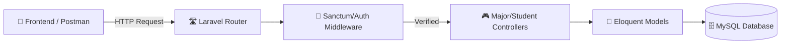
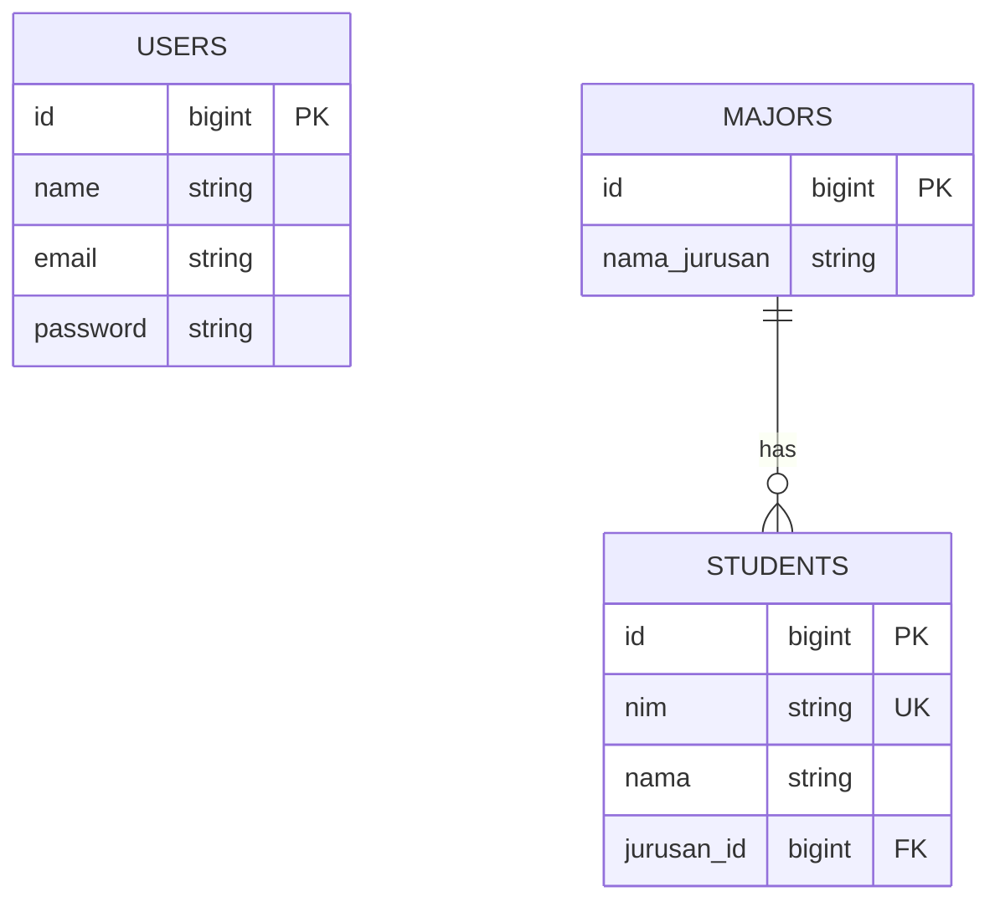

# 🎓 Student Management API — Production Laravel Backend

A comprehensive RESTful API built with **Laravel 11**, focusing on institutional student data management. Engineered with a stateless architecture, deep relational data mapping, and containerized deployment readiness.

[](https://student-management-api-production-b847.up.railway.app)
[](https://php.net)
[](https://laravel.com)
[](https://docker.com)

---

## 🏗 System Architecture

This API serves as a robust middleware layer, handling authentication, business constraints, and relational persistence.



---

## ✨ Features

- **🔐 Stateless Auth:** Secure token-based authentication using Laravel Sanctum.
- **🛡 Eloquent ORM:** Advanced relational mapping between Students and Majors with eager loading (N+1 protection).
- **📂 Mass Assignment Protection:** Strictly guarded model attributes for secure data entry.
- **📄 API Versioning:** Structured for scalability and backward compatibility.
- **🐳 Containerized:** Fully Dockerized environment for consistent staging and production builds.

---

## 🔌 API Endpoints

### 🔐 Authentication
| Method | Endpoint | Description |
|---|---|---|
| `POST` | `/api/auth/register` | User account creation |
| `POST` | `/api/auth/login` | Token generation |

### 🎓 Academic Core
*Requires `Authorization: Bearer <token>`*
| Method | Endpoint | Description |
|---|---|---|
| `GET` | `/api/students` | Paginated student list |
| `POST` | `/api/students` | Enroll new student |
| `GET` | `/api/majors` | List of academic majors |
| `PUT` | `/api/students/{id}` | Update record details |

---

## 🗄 Database Schema

Designed for high relational integrity with indexed fields for fast lookups.



---

## 🚀 Deployment & Setup

### Local Installation
1. **Clone Repo:**
   ```bash
   git clone https://github.com/B3rlinSugi/student-management-api.git
   cd student-management-api
   ```

2. **Environment:**
   ```bash
   composer install
   cp .env.example .env
   php artisan key:generate
   ```

3. **Database:**
   Configure your `.env` with MySQL credentials, then sync:
   ```bash
   php artisan migrate
   ```

### 🐳 Docker Usage
```bash
docker-compose up -d
```

---

## 👨‍💻 Developed By

**Berlin Sugiyanto Hutajulu**

[](https://github.com/B3rlinSugi)
[](https://linkedin.com/in/berlinsugi)
[](https://berlinsugi.vercel.app)

---
<p align="center">Built with 💎 and Laravel 11 · Scalable RESTful Services</p>

